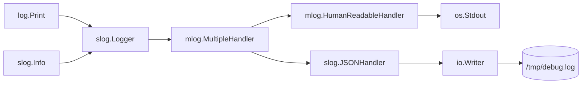

mLog -- advanced handlers to improve GOlang's built-in log functionality
---

[](https://pkg.go.dev/github.com/xenolog/mlog/)

mLog provides a following handlers:

* **MultipleHandler** -- allows to write one log event to multiple destinations.
* **HumanReadableHandler** -- Alternative structured log representation where timestamp, level and message show as plain text line, but additional attributes show in the JSON block

---

**MultipleHandler**  example:

this code log events to the different destinations:

* debug level to a file
* info and above in human readable format to the stdout

```golang
func main() {
  debugLogFile := "/tmp/debug.log"

  // create file to write debug stream
  debugWriter, err := os.OpenFile(debugLogFile, os.O_APPEND|os.O_CREATE|os.O_WRONLY, 0o644)
  if err != nil {
    log.Fatal(err)
  }

  // create handlers to store logged events
  debugHandler := slog.NewJSONHandler(debugWriter, &slog.HandlerOptions{AddSource: true, Level: slog.LevelDebug})
  stdHandler := mlog.NewHumanReadableHandler(os.Stdout, &mlog.HumanReadableHandlerOptions{Level: slog.LevelInfo})

  // combine log handlers and initialize logger
  logHandler := mlog.NewMultipleHandler(nil, debugHandler, stdHandler)
  logger := slog.New(logHandler)
  slog.SetDefault(logger) // redirect all log streams (ancient log and slog) to a freshly created logger

  logger.Debug("first message", "now", time.Now())
  logger.Error("second message", "now", time.Now())
  log.Print("third message, using log.Print(...)")
  slog.Debug("fourth message", "now", time.Now())
}
```

After run this code we will see a following results:

`stdout:`

```log
2023-11-23T15:30:09.224406Z E --  second message  ATTRS={"now":"2023-11-23T18:30:09.224402+03:00"}
2023-11-23T15:30:09.224551Z I --  third message, using log.Print(...)
```

`cat /tmp/debug.log`

```log
{"time":"2023-11-23T18:30:09.223927+03:00","level":"DEBUG","source":{"function":"main.main","file":"/src/mlog/examples/multiple_destinations.go","line":34},"msg":"first message","now":"2023-11-23T18:30:09.223908+03:00"}
{"time":"2023-11-23T18:30:09.224406+03:00","level":"ERROR","source":{"function":"main.main","file":"/src/mlog/examples/multiple_destinations.go","line":35},"msg":"second message","now":"2023-11-23T18:30:09.224402+03:00"}
{"time":"2023-11-23T18:30:09.224551+03:00","level":"INFO","msg":"third message, using log.Print(...)"}
{"time":"2023-11-23T18:30:09.224589+03:00","level":"DEBUG","source":{"function":"main.main","file":"/src/mlog/examples/multiple_destinations.go","line":37},"msg":"fourth message","now":"2023-11-23T18:30:09.224586+03:00"}
```

Diagram of interaction between logging subsystem components


---

**HumanReadableHandler** is a alternative structured log representation where
timestamp, level and message wrote as plain text line,
but additional attributes show as JSON block.

A log record consists of a time, a level, a message, and a set of key-value
pairs, where the keys are strings and the values may be of any type.
As an example,

	slog.Info("hello", "count", 3)

creates a record containing the time of the call,
a level of Info, the message "hello", and a single
pair with key "count" and value 3.

The default handler formats the log record's message, time, level, and attributes
as a string and passes it to the `log` package.

	2022/11/08 15:28:26 INFO hello count=3

For more control over the output format, create a logger with a different handler.
This statement uses `slog.New` to create a new logger with a HumanReadableHandler
that writes structured records in text form to standard error:

	logger := slog.New(mlog.HumanReadableHandler(os.Stderr, nil))

HumanReadableHandler output is a sequence of timestamp, level and message as plain text
to human readability and additional key=value pairs as JSON, easily and unambiguously
parsed by machine. This statement:

	logger.Info("hello", "count", 3)

produces this output:

	2023-11-23T15:30:09.224406Z I --  hello  ATTRS={"count":3}

Setting a logger as the default with

	slog.SetDefault(logger)

will cause the top-level functions like slog.Info to use it.
`slog.SetDefault` also updates the default logger used by the `log` package,
so that existing applications that use `log.Printf` and related functions
will send log records to the logger's handler without needing to be rewritten.

---
See `examples/` and unit tests code to addition information. Enjoy!
